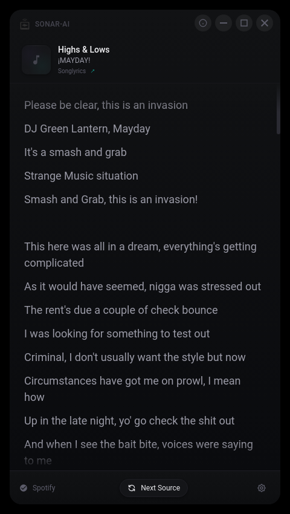

# SonarAI

Cross-platform lyrics viewer with Spotify-inspired UI

<p align="center">
  
</p>

## Features

- Real-time song detection via Spotify D-Bus integration
- Synced and unsynced lyrics from multiple sources
- Neo-Noir Glass Monitor dark theme
- Python backend for lyrics fetching and caching
- Cross-platform: macOS, Windows, Linux

## Requirements

- Node.js 18+
- Python 3.x
- Spotify (or compatible media player)

## Quick Start

```bash
# Install dependencies
npm install

# Run from source
bash run-source-linux.sh    # Linux
bash run-source-mac.sh      # macOS
run-source-windows.bat      # Windows
```

## Build

```bash
npm run build:linux    # Linux .deb / AppImage
npm run build:mac      # macOS .dmg
npm run build:win      # Windows .exe
```

## License

MIT License - Jason Paul Michaels
